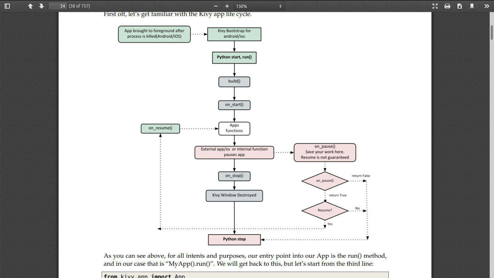
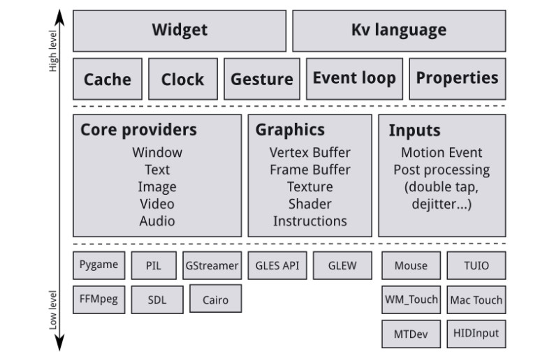

# Kivy Tutorials
**Link**: https://buildmedia.readthedocs.org/media/pdf/kivy/latest/kivy.pdf
 
 
All the code that I write going through the official Kivy Tutorials

## Kivy App Lifecycle

## Kivy App Architecture

**Core Providers**:
A piece of code that uses an API to talk to the operating system on one side and to Kivy on the other.
