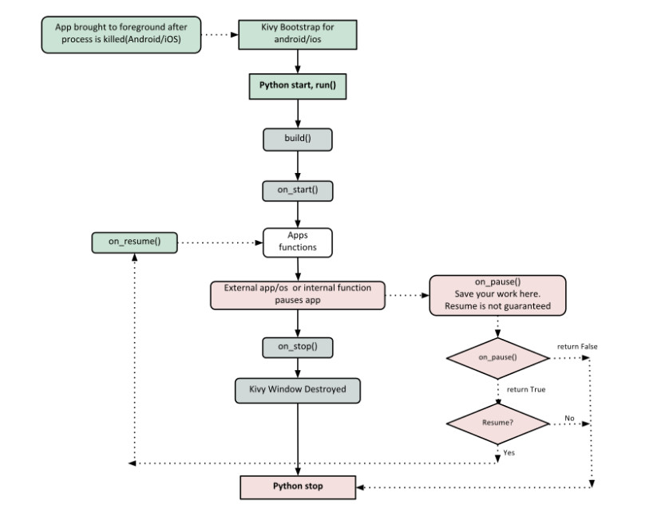
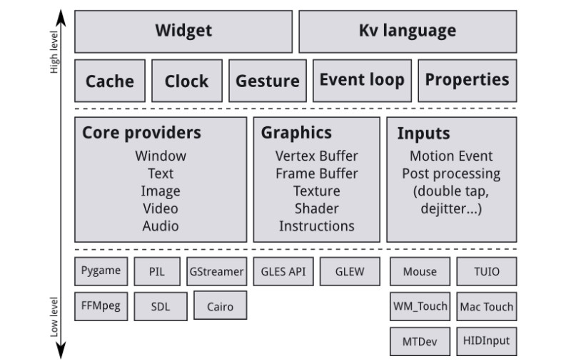
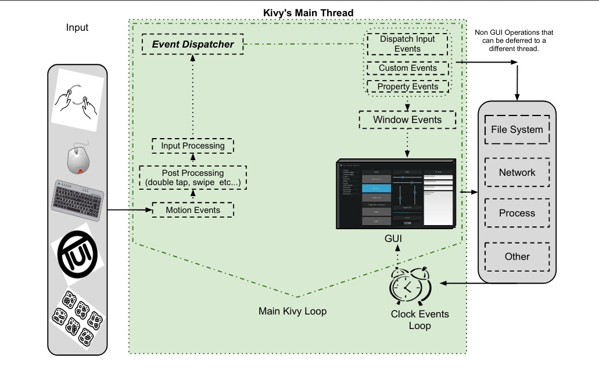

# Kivy Tutorials
All the code that I write while learning the Kivy library in Python.

## Kivy App Lifecycle

## Kivy App Architecture

 

**Core Provider**:
A piece of code that uses an API to talk to the operating system on one side and to Kivy on the other. 
**Input Provider**:
A piece of code that adds support to an input device

### Core Package
  - Clock: schedule timer events
  - Cache: cache something that you use often
  - Gesture Detection: detect various kinds of strokes
  - Kivy Language: efficiently describe user interfaces
  - Properties: link widget code to UI description

### UIX
  - Widgets: user interface elements that offers functionality to your program
  - Layouts: used to arrange widgets

### Input Events (Touches)
Three states of touches:
  - Down: a touch is down only once, at the very moment where it first appears
  - Move: whenever a 2D position of the touch changes
  - Up: a touch goes up at most once, or never.

## Event Handling in Kivy

## RESOURCES
  - [Paint App Tutorial](https://kivy.org/doc/stable/tutorials/firstwidget.html){:target="_blank"}
  - [Pong Game Tutorial](https://kivy.org/doc/stable/tutorials/pong.html){:target="_blank"}
  - [Kivy API Reference](https://kivy.org/doc/stable/api-kivy.html){:target="_blank"}
  - [Kivy Tutorial PDF](https://buildmedia.readthedocs.org/media/pdf/kivy/latest/kivy.pdf){:target="_blank"}
